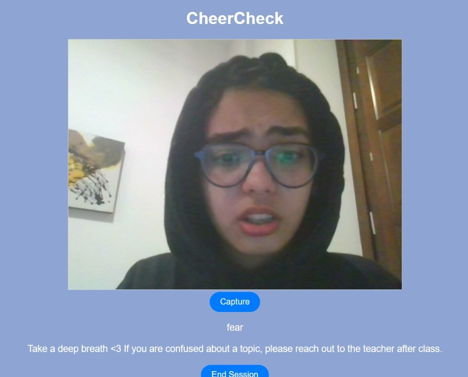
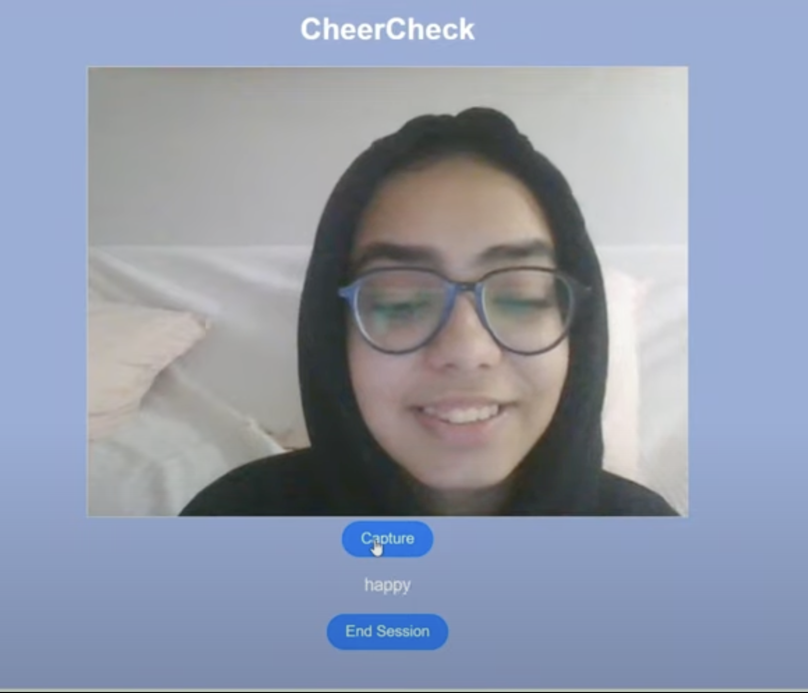

Hello, I am Zoya, a high school student from Abidjan, Ivory Coast.

# Cheer Check

The world changed after covid and remote learning became a norm.

Due to social media, our attention span has significantly reduced. We are so used to bite-sized entertaining content, that sitting in longer lectures and absorbing what the teacher is saying has became very difficult. 

Also, in remote learning, it’s very hard for the teacher to deliver the lecture and observe students’ reactions at the same time. This makes it difficult for the teacher to understand how students are reacting to the material taught. 

# What does it do?

Cheer Check is a web application that students can start at the beginning of every class. Then, the application captures the student’s expressions at regular intervals for example every 10 minutes. If the student appears sad or annoyed, the app will prompt a cheering message that can help students regain focus and feel calm. 

At the end each session, a mood report is generated and emailed to the teacher or parents. 

The teachers can then use this information to figure out how the students are responding to the course material. For example which parts of the lectures were more boring or confusing etc. 






# Tech Stack

* ```Python```
* ```Flask``` for the actual web-app implementatio
* ```Deepfake``` for image classification
* ```yagmail``` for sending emails
* ```tabulate``` for formatting data before sending emails

## Challenges Faced

* This project required extensive research before and during the actual implementation. Finding out what tools and technologies could be used to detect emotions was a bit challenging. Once I discovered DeepFace, I spent a good amount of time understanding the basics of how it works in the background.

* Local setup: installing deepface, along with its dependencies like tensorflow was quite challenging since there were lots of version mismatch issues initally. 

* This was my first ever Flask project so it was challenging to figure out how to put things together. 

* I also faced any security/cors related errors while working with emailing libraries but it was sorted out eventually.

* Deployment: I wanted to deploy this online but the free websites I found weren't suitable for this task. This was because the libraries I was using needed a bit more resoruces than the free tiers offers.

## Accomplishment 

Successfully figured out how to use new libraries like Deepfake, yagmail in combination with Flask.

## Future Developments 

* Personalized image classification modes: To further improve the accuracy of this application, each student can train their own image classification model while setting up the application. This can be achieved in a fun & easy way through Google’s Teachable Machine. 
* Convert this into a browser extension or desktop application that can keep running in the background while students are attending classes.

## Try it Out

* Clone the project
```
git clone 
```

* Install the required Python libraries
```
pip install -r requirements.txt
```
* Generate an app password for your gmail account and modify the values in app.py:
```
def send_email(emotions_list):
    sender_email = ""
    receiver_email = ""
    password = "" 
```
* Run ```python app.py```

* Open the designated server in your browser e.g, ```http://127.0.0.1:5000```

Youtube: [https://www.youtube.com/watch?v=Q0SpQfakKfI](https://youtu.be/bGGWlrZpywM?si=Uat_Qg_RkeOycIVz)
